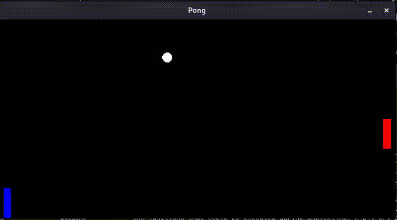
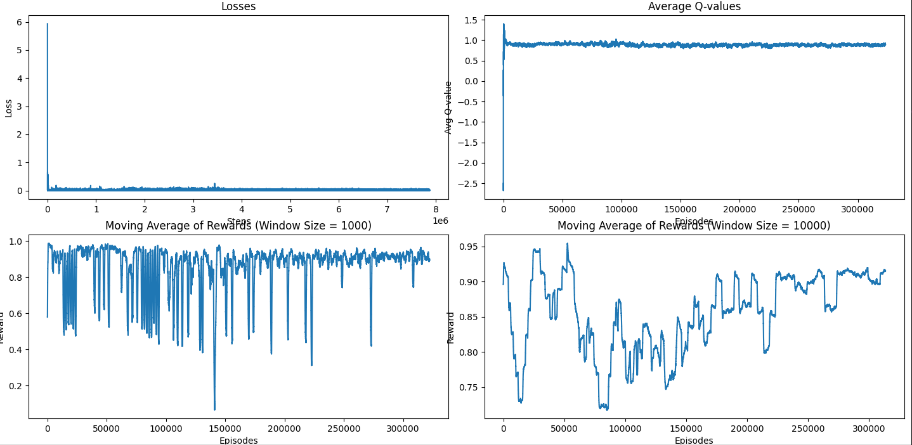

## "Why do we fall, sir? Because it's Reinforcement learning."

Implemented AI player in Pong game, with Custom Environment!

## How does it play?
-> After 140k episodes
<p align="center">
  
</p>
  
-> After 220k episodes  
<p align="center">
  
</p>

-> After 320k episodes  
<p align="center">
  
</p>

## Loss Graph
<p align="center">
  
</p>

## Installation

```
git clone https://github.com/a-b-h-a-y-s-h-i-n-d-e/Pong-Game-with-Reinforcement-Learning.git
```
```
pip install -r requirements.txt
```
## Play against AI
```
python main.py 
```


## Train from scratch?

<p align="center">
  
</p>  
-> Delete the trained_model.pth and buffer.pkl files first! <br /> 

```
cd DQN
```
<br />

-> select num_of_episodes in train.py  
```
python train.py
```

